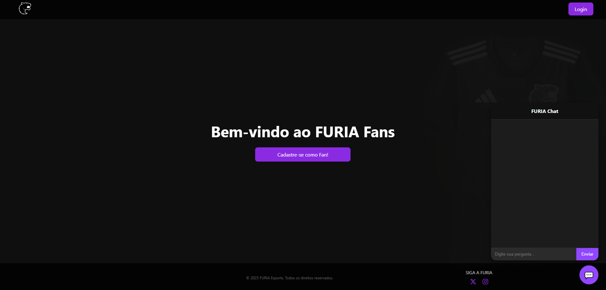
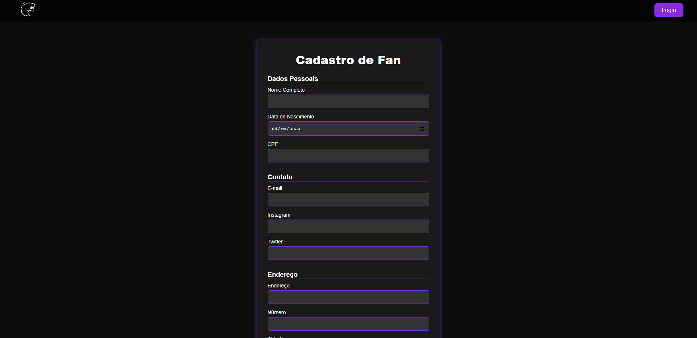

# KYF FURIA - Know Your Fans (Estudo de Caso Técnico) 🐾


---

## 📜 Visão Geral do Projeto

Este repositório serve como um **estudo de caso técnico** para o **KYF FURIA (Know Your Fans)**, um projeto que explorei para criar uma plataforma de engajamento para a comunidade da FURIA Esports. A solução completa incluía um chatbot interativo para responder perguntas e um sistema de cadastro de fãs.

O objetivo principal foi arquitetar e construir uma aplicação web robusta, demonstrando a integração de um backend em **Laravel (PHP)** com serviços modernos de BaaS (*Backend as a Service*) como **Supabase** para persistência de dados e **n8n** para automação de workflows e respostas do chatbot.

*Nota: O projeto encontra-se arquivado e as integrações com serviços externos (Supabase, n8n) estão desativadas.*

---

## ✨ Funcionalidades Principais

A aplicação foi projetada com duas funcionalidades centrais para engajar a comunidade:

1.  **Cadastro de Fãs:** Um formulário completo para que os fãs pudessem se registrar, criando uma base de dados da comunidade.
2.  **Chatbot Interativo:** Uma interface de chat para que os usuários pudessem interagir e receber informações automatizadas.

---

## 🖼️ Galeria de Imagens

A interface da aplicação foi projetada para ser limpa e intuitiva, focando nas duas funcionalidades principais.

<p align="center">
  
  <br>
  <em>Tela principal da aplicação, exibindo a interface do chatbot flutuante.</em>
</p>
<br>
<p align="center">
  
  <br>
  <em>Tela com o formulário de cadastro de fãs, com campos para informações pessoais e de contato.</em>
</p>

---

## 🛠️ Stack de Tecnologias

- **Backend:** Laravel (PHP)
- **Frontend:** Blade, Tailwind CSS, JavaScript Vanilla
- **Banco de Dados:** Supabase (PostgreSQL)
- **Automação / IA:** n8n para orquestração de workflows e respostas do chatbot.
- **Ferramentas:** Git, GitHub, Composer, NPM/Vite.

---

## 🚀 Como Executar Localmente (Frontend)**

As instruções abaixo permitem executar a interface de frontend do projeto.

*Nota: A conexão com o backend (Supabase, n8n) requer configuração de credenciais em um arquivo `.env`.*

```bash
# 1. Clone o repositório
git clone [https://github.com/nathanmoreeira/kyf-furia.git](https://github.com/nathanmoreeira/kyf-furia.git)

# 2. Navegue até a pasta do projeto
cd kyf-furia

# 3. Instale as dependências do PHP (Composer) e do Node (NPM)
composer install
npm install

# 4. Crie o arquivo de ambiente a partir do exemplo
cp .env.example .env

# 5. Gere a chave da aplicação Laravel
php artisan key:generate

# 6. Compile os assets de frontend
npm run dev

# 7. Inicie o servidor de desenvolvimento do Laravel
php artisan serve
```
Acesse o projeto em http://localhost:8000.
